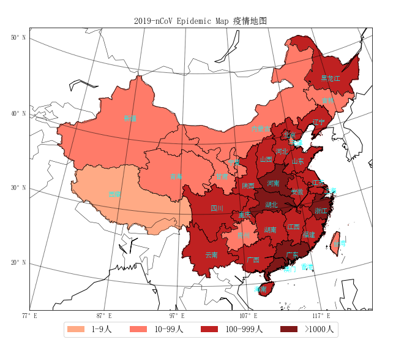
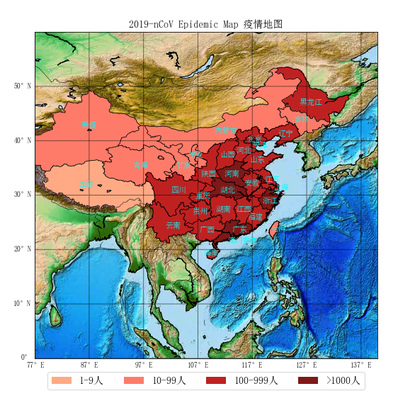

# 2019-nCoV  
2019新型冠状病毒疫情信息的爬取与可视化- Crawling and Visualization about Daily Information of 2019 novel Coronavirus Epidemic in China Mainland
数据采集网站是丁香园, The data source is Ding Xiang Yuan, https://ncov.dxy.cn/ncovh5/view/pneumonia

```python
# -*- coding: utf-8 -*-
"""
Created on Wed Feb  2 16:39:51 2020
"""
import requests,os
import re
import xlwt
import time
import json

class get_yq_info:

    def get_data_html(self):
            headers = {'User-Agent': 'Mozilla/5.0 (Windows NT 6.1; WOW64) AppleWebKit/535.1 (KHTML, like Gecko) Chrome/14.0.835.163 Safari/535.1'}
            response = requests.get('https://ncov.dxy.cn/ncovh5/view/pneumonia?from=timeline&isappinstalled=0', headers=headers, timeout=3)
            # 请求页面

            response = str(response.content, 'utf-8')
            # 中文重新编码
            return response
            #返回了HTML数据

    def get_data_dictype(self):
            areas_type_dic_raw = re.findall('try { window.getAreaStat = (.*?)}catch\(e\)',self.get_data_html())
            areas_type_dic = json.loads(areas_type_dic_raw[0])
            return areas_type_dic
            #返回经过json转换过的字典化的数据

    def save_data_to_excle(self):
            self.make_dir()
            #调用方法检查数据目录是否存在，不存在则创建数据文件夹
            count = 2
            #数据写入行数记录
            newworkbook = xlwt.Workbook()
            worksheet = newworkbook.add_sheet('all_data')
            # 打开工作簿，创建工作表

            worksheet.write(1, 2, '省份名称')
            worksheet.write(1, 3, '省份简称或城市名称')
            worksheet.write(1, 4, '确诊人数')
            worksheet.write(1, 5, '疑似人数')
            worksheet.write(1, 6, '治愈人数')
            worksheet.write(1, 7, '死亡人数')
            worksheet.write(1, 8, '地区ID编码')
            #写入数据列标签

            for province_data in self.get_data_dictype():
                    provincename = province_data['provinceName']
                    provinceshortName = province_data['provinceShortName']
                    p_confirmedcount = province_data['confirmedCount']
                    p_suspectedcount = province_data['suspectedCount']
                    p_curedcount = province_data['curedCount']
                    p_deadcount = province_data['deadCount']
                    p_locationid = province_data['locationId']
                    #用循环获取省级以及该省以下城市的数据

                    worksheet.write(count, 2, provincename)
                    worksheet.write(count, 3, provinceshortName)
                    worksheet.write(count, 4, p_confirmedcount)
                    worksheet.write(count, 5, p_suspectedcount)
                    worksheet.write(count, 6, p_curedcount)
                    worksheet.write(count, 7, p_deadcount)
                    worksheet.write(count, 8, p_locationid)
                    #在工作表里写入省级数据

                    count += 1
                    #此处为写入行数累加，province部分循环

                    for citiy_data in province_data['cities']:
                            cityname = citiy_data['cityName']
                            c_confirmedcount = citiy_data['confirmedCount']
                            c_suspectedcount = citiy_data['suspectedCount']
                            c_curedcount = citiy_data['curedCount']
                            c_deadcount = citiy_data['deadCount']
                            c_locationid = citiy_data['locationId']
                            #该部分获取某个省下某城市的数据
                            print(cityname)
                            print(c_confirmedcount)
                            worksheet.write(count, 3, cityname)
                            worksheet.write(count, 4, c_confirmedcount)
                            worksheet.write(count, 5, c_suspectedcount)
                            worksheet.write(count, 6, c_curedcount)
                            worksheet.write(count, 7, c_deadcount)
                            worksheet.write(count, 8, c_locationid)
                            #该部分在工作表里写入某城市的数据

                            count += 1
                            #此处为写入行数累加，cities部分循环
            current_time = time.strftime("%Y-%m-%d-%H-%M-%S", time.localtime())
            newworkbook.save('F:\2019_nCoV_crawling_info\2019_nCoV_crawling_info-%s.xls' % (current_time))
            print('======数据爬取成功======')

    def make_dir(self):
            file_path = 'F:/2019_nCoV_crawling_info/'
            if not os.path.exists(file_path):
                    os.makedirs(file_path)
                    print('======数据文件夹不存在=======')
                    print('======数据文件夹创建成功======')
                    print('======创建目录为%s======'%(file_path))
            else:
                    print('======数据保存在目录：%s======' % (file_path))
            #检查并创建数据目录


get_yq_info().save_data_to_excle()


fig = matplotlib.figure.Figure()
fig.set_size_inches(width/100, height/100) # 设置绘图板尺寸
axes = fig.add_axes(rect)
    
# 兰博托投影模式，局部
m = Basemap(projection='lcc', llcrnrlon=77, llcrnrlat=14, urcrnrlon=140, urcrnrlat=51, lat_1=33, lat_2=45, lon_0=100, ax=axes)
    
# 兰博托投影模式，全图
#m = Basemap(projection='lcc', llcrnrlon=80, llcrnrlat=0, urcrnrlon=140, urcrnrlat=51, lat_1=33, lat_2=45, lon_0=100, ax=axes)
    
# 圆柱投影模式，局部
#m = Basemap(llcrnrlon=lon_min, urcrnrlon=lon_max, llcrnrlat=lat_min, urcrnrlat=lat_max, resolution='l', ax=axes)
    
# 正射投影模式
#m = Basemap(projection='ortho', lat_0=36, lon_0=102, resolution='l', ax=axes)
	
# 全球等经纬投影模式，
#m = Basemap(llcrnrlon=lon_min, urcrnrlon=lon_max, llcrnrlat=lat_min, urcrnrlat=lat_max, resolution='l', ax=axes)
#m.etopo()
    
m.readshapefile('res/china-shapefiles-master/china', 'province', drawbounds=True)
m.readshapefile('res/china-shapefiles-master/china_nine_dotted_line', 'section', drawbounds=True)
m.drawcoastlines(color='black') # 洲际线
m.drawcountries(color='black')  # 国界线
m.drawparallels(np.arange(lat_min,lat_max,10), labels=[1,0,0,0]) #画经度线
m.drawmeridians(np.arange(lon_min,lon_max,10), labels=[0,0,0,1]) #画纬度线
    
pset = set()
for info, shape in zip(m.province_info, m.province):
    pname = info['OWNER'].strip('\x00')
    fcname = info['FCNAME'].strip('\x00')
    if pname != fcname: # 不绘制海岛
      continue
        
        for key in data.keys():
            if key in pname:
                if data[key] == 0:
                    color = '#f0f0f0'
                elif data[key] < 10:
                    color = '#ffaa85'
                elif data[key] <100:
                    color = '#ff7b69'
                elif  data[key] < 1000:
                    color = '#bf2121'
                else:
                    color = '#7f1818'
                break
        
        poly = Polygon(shape, facecolor=color, edgecolor=color)
        axes.add_patch(poly)
        
        pos = provincePos[pname]
        text = pname.replace("自治区", "").replace("特别行政区", "").replace("壮族", "").replace("维吾尔", "").replace("回族", "").replace("省", "").replace("市", "")
        if text not in pset:
            x,  y = m(pos[0], pos[1])
            axes.text(x,  y, text, fontproperties=font_11, color='#00FFFF')
            pset.add(text)
    
axes.legend(handles, labels, bbox_to_anchor=(0.5, -0.11), loc='lower center', ncol=4, prop=font_14)
axes.set_title("2019-nCoV Epidemic Map 疫情地图", fontproperties=font_14)
FigureCanvasAgg(fig)
fig.savefig('2019-nCoV疫情地图.png')

```
# A sample of output was shown as followings:
2020, Feb 14






| 省份名称 Province Name | 省份或城市名称 Provice/City Name | 确诊人数 Confirmed Count | 疑似人数 Suspected Count | 治愈人数 Cured Count | 死亡人数 Dead Count | 地区ID编码 Location ID |
|------------------------|----------------------------------|--------------------------|--------------------------|----------------------|---------------------|------------------------|
| 湖北省                 | 湖北                             | 48206                    | 0                        | 3459                 | 1310                | 420000                 |
|                        | 武汉                             | 32994                    | 0                        | 1923                 | 1036                | 420100                 |
|                        | 孝感                             | 2874                     | 0                        | 209                  | 49                  | 420900                 |
|                        | 黄冈                             | 2662                     | 0                        | 427                  | 58                  | 421100                 |
|                        | 荆州                             | 1431                     | 0                        | 104                  | 23                  | 421000                 |
|                        | 随州                             | 1160                     | 0                        | 62                   | 14                  | 421300                 |
|                        | 襄阳                             | 1101                     | 0                        | 66                   | 13                  | 420600                 |
|                        | 鄂州                             | 1065                     | 0                        | 97                   | 30                  | 420700                 |
|                        | 荆门                             | 927                      | 0                        | 93                   | 24                  | 420800                 |
|                        | 黄石                             | 911                      | 0                        | 115                  | 9                   | 420200                 |
|                        | 宜昌                             | 810                      | 0                        | 72                   | 11                  | 420500                 |
|                        | 十堰                             | 562                      | 0                        | 81                   | 1                   | 420300                 |
|                        | 咸宁                             | 534                      | 0                        | 85                   | 7                   | 421200                 |
|                        | 仙桃                             | 480                      | 0                        | 48                   | 16                  | 429004                 |
|                        | 天门                             | 362                      | 0                        | 13                   | 10                  | 429006                 |
|                        | 恩施州                           | 229                      | 0                        | 48                   | 4                   | 422800                 |
|                        | 潜江                             | 94                       | 0                        | 8                    | 5                   | 429005                 |
|                        | 神农架林区                       | 10                       | 0                        | 8                    | 0                   | 429021                 |
| 广东省                 | 广东                             | 1241                     | 0                        | 314                  | 2                   | 440000                 |
|                        | 深圳                             | 391                      | 0                        | 94                   | 0                   | 440300                 |
|                        | 广州                             | 327                      | 0                        | 78                   | 0                   | 440100                 |
|                        | 佛山                             | 81                       | 0                        | 17                   | 0                   | 440600                 |
|                        | 东莞                             | 70                       | 0                        | 7                    | 0                   | 441900                 |
|                        | 珠海                             | 89                       | 0                        | 27                   | 0                   | 440400                 |
|                        | 中山                             | 64                       | 0                        | 22                   | 0                   | 442000                 |
|                        | 惠州                             | 55                       | 0                        | 14                   | 0                   | 441300                 |
|                        | 江门                             | 22                       | 0                        | 4                    | 0                   | 440700                 |
|                        | 汕头                             | 25                       | 0                        | 8                    | 0                   | 440500                 |
|                        | 茂名                             | 13                       | 0                        | 2                    | 0                   | 440900                 |
|                        | 湛江                             | 21                       | 0                        | 11                   | 0                   | 440800                 |
|                        | 肇庆                             | 16                       | 0                        | 7                    | 1                   | 441200                 |
|                        | 阳江                             | 13                       | 0                        | 5                    | 0                   | 441700                 |
|                        | 梅州                             | 13                       | 0                        | 5                    | 0                   | 441400                 |
|                        | 清远                             | 12                       | 0                        | 5                    | 0                   | 441800                 |
|                        | 韶关                             | 8                        | 0                        | 3                    | 0                   | 440200                 |
|                        | 揭阳                             | 8                        | 0                        | 3                    | 0                   | 445200                 |
|                        | 潮州                             | 5                        | 0                        | 0                    | 0                   | 445100                 |
|                        | 汕尾                             | 5                        | 0                        | 1                    | 0                   | 441500                 |
|                        | 河源                             | 3                        | 0                        | 1                    | 0                   | 441600                 |
|                        | 待明确地区                       | 0                        | 0                        | 0                    | 1                   | 0                      |
| 河南省                 | 河南                             | 1169                     | 0                        | 296                  | 10                  | 410000                 |
|                        | 信阳                             | 240                      | 0                        | 49                   | 0                   | 411500                 |
|                        | 南阳                             | 145                      | 0                        | 38                   | 2                   | 411300                 |
|                        | 驻马店                           | 134                      | 0                        | 42                   | 0                   | 411700                 |
|                        | 郑州                             | 141                      | 0                        | 54                   | 0                   | 410100                 |
|                        | 商丘                             | 87                       | 0                        | 25                   | 2                   | 411400                 |
|                        | 周口                             | 68                       | 0                        | 20                   | 0                   | 411600                 |
|                        | 新乡                             | 54                       | 0                        | 7                    | 2                   | 410700                 |
|                        | 安阳                             | 50                       | 0                        | 13                   | 0                   | 410500                 |
|                        | 平顶山                           | 56                       | 0                        | 19                   | 1                   | 410400                 |
|                        | 许昌                             | 34                       | 0                        | 3                    | 0                   | 411000                 |
|                        | 漯河                             | 33                       | 0                        | 6                    | 0                   | 411100                 |
|                        | 洛阳                             | 30                       | 0                        | 4                    | 0                   | 410300                 |
|                        | 焦作                             | 29                       | 0                        | 5                    | 1                   | 410800                 |
|                        | 开封                             | 25                       | 0                        | 3                    | 0                   | 410200                 |
|                        | 鹤壁                             | 19                       | 0                        | 4                    | 0                   | 410600                 |
|                        | 濮阳                             | 13                       | 0                        | 1                    | 0                   | 410900                 |
|                        | 三门峡                           | 7                        | 0                        | 3                    | 0                   | 411200                 |
|                        | 济源                             | 4                        | 0                        | 0                    | 0                   | 419001                 |
|                        | 待明确地区                       | 0                        | 0                        | 0                    | 2                   | 0                      |
| 浙江省                 | 浙江                             | 1145                     | 0                        | 360                  | 0                   | 330000                 |
|                        | 温州                             | 490                      | 0                        | 140                  | 0                   | 330300                 |
|                        | 宁波                             | 153                      | 0                        | 35                   | 0                   | 330200                 |
|                        | 杭州                             | 162                      | 0                        | 63                   | 0                   | 330100                 |
|                        | 台州                             | 144                      | 0                        | 49                   | 0                   | 331000                 |
|                        | 嘉兴                             | 42                       | 0                        | 8                    | 0                   | 330400                 |
|                        | 金华                             | 55                       | 0                        | 24                   | 0                   | 330700                 |
|                        | 绍兴                             | 41                       | 0                        | 15                   | 0                   | 330600                 |
|                        | 衢州                             | 21                       | 0                        | 8                    | 0                   | 330800                 |
|                        | 丽水                             | 17                       | 0                        | 9                    | 0                   | 331100                 |
|                        | 湖州                             | 10                       | 0                        | 4                    | 0                   | 330500                 |
|                        | 舟山                             | 10                       | 0                        | 5                    | 0                   | 330900                 |
| 安徽省                 | 安徽                             | 910                      | 0                        | 157                  | 5                   | 340000                 |
|                        | 蚌埠                             | 146                      | 0                        | 3                    | 4                   | 340300                 |
|                        | 合肥                             | 161                      | 0                        | 28                   | 1                   | 340100                 |
|                        | 阜阳                             | 142                      | 0                        | 23                   | 0                   | 341200                 |
|                        | 亳州                             | 100                      | 0                        | 16                   | 0                   | 341600                 |
|                        | 六安                             | 60                       | 0                        | 3                    | 0                   | 341500                 |
|                        | 安庆                             | 80                       | 0                        | 29                   | 0                   | 340800                 |
|                        | 宿州                             | 38                       | 0                        | 8                    | 0                   | 341300                 |
|                        | 芜湖                             | 31                       | 0                        | 5                    | 0                   | 340200                 |
|                        | 马鞍山                           | 32                       | 0                        | 8                    | 0                   | 340500                 |
|                        | 淮北                             | 25                       | 0                        | 6                    | 0                   | 340600                 |
|                        | 铜陵                             | 28                       | 0                        | 10                   | 0                   | 340700                 |
|                        | 淮南                             | 23                       | 0                        | 6                    | 0                   | 340400                 |
|                        | 池州                             | 16                       | 0                        | 3                    | 0                   | 341700                 |
|                        | 滁州                             | 13                       | 0                        | 4                    | 0                   | 341100                 |
|                        | 黄山                             | 9                        | 0                        | 1                    | 0                   | 341000                 |
|                        | 宣城                             | 6                        | 0                        | 4                    | 0                   | 341800                 |
| 江西省                 | 江西                             | 872                      | 0                        | 170                  | 1                   | 360000                 |
|                        | 南昌                             | 210                      | 0                        | 61                   | 0                   | 360100                 |
|                        | 上饶                             | 119                      | 0                        | 17                   | 0                   | 361100                 |
|                        | 九江                             | 109                      | 0                        | 14                   | 0                   | 360400                 |
|                        | 新余                             | 121                      | 0                        | 28                   | 0                   | 360500                 |
|                        | 宜春                             | 95                       | 0                        | 16                   | 0                   | 360900                 |
|                        | 赣州                             | 76                       | 0                        | 10                   | 1                   | 360700                 |
|                        | 抚州                             | 69                       | 0                        | 14                   | 0                   | 361000                 |
|                        | 萍乡                             | 29                       | 0                        | 2                    | 0                   | 360300                 |
|                        | 鹰潭                             | 18                       | 0                        | 2                    | 0                   | 360600                 |
|                        | 吉安                             | 20                       | 0                        | 5                    | 0                   | 360800                 |
|                        | 景德镇                           | 5                        | 0                        | 1                    | 0                   | 360200                 |
|                        | 赣江新区                         | 1                        | 0                        | 0                    | 0                   | 0                      |
| 湖南省                 | 湖南                             | 968                      | 0                        | 339                  | 2                   | 430000                 |
|                        | 长沙                             | 228                      | 0                        | 63                   | 0                   | 430100                 |
|                        | 岳阳                             | 148                      | 0                        | 42                   | 1                   | 430600                 |
|                        | 邵阳                             | 99                       | 0                        | 41                   | 1                   | 430500                 |
|                        | 株洲                             | 75                       | 0                        | 21                   | 0                   | 430200                 |
|                        | 常德                             | 77                       | 0                        | 26                   | 0                   | 430700                 |
|                        | 娄底                             | 72                       | 0                        | 22                   | 0                   | 431300                 |
|                        | 益阳                             | 59                       | 0                        | 22                   | 0                   | 430900                 |
|                        | 永州                             | 43                       | 0                        | 18                   | 0                   | 431100                 |
|                        | 郴州                             | 38                       | 0                        | 15                   | 0                   | 431000                 |
|                        | 衡阳                             | 45                       | 0                        | 25                   | 0                   | 430400                 |
|                        | 湘潭                             | 32                       | 0                        | 12                   | 0                   | 430300                 |
|                        | 怀化                             | 39                       | 0                        | 23                   | 0                   | 431200                 |
|                        | 湘西自治州                       | 8                        | 0                        | 6                    | 0                   | 433100                 |
|                        | 张家界                           | 5                        | 0                        | 3                    | 0                   | 430800                 |
| 江苏省                 | 江苏                             | 570                      | 0                        | 139                  | 0                   | 320000                 |
|                        | 苏州                             | 85                       | 0                        | 17                   | 0                   | 320500                 |
|                        | 南京                             | 90                       | 0                        | 26                   | 0                   | 320100                 |
|                        | 徐州                             | 71                       | 0                        | 17                   | 0                   | 320300                 |
|                        | 淮安                             | 51                       | 0                        | 6                    | 0                   | 320800                 |
|                        | 无锡                             | 49                       | 0                        | 9                    | 0                   | 320200                 |
|                        | 连云港                           | 42                       | 0                        | 6                    | 0                   | 320700                 |
|                        | 南通                             | 38                       | 0                        | 11                   | 0                   | 320600                 |
|                        | 常州                             | 38                       | 0                        | 12                   | 0                   | 320400                 |
|                        | 泰州                             | 37                       | 0                        | 15                   | 0                   | 321200                 |
|                        | 盐城                             | 25                       | 0                        | 6                    | 0                   | 320900                 |
|                        | 扬州                             | 20                       | 0                        | 6                    | 0                   | 321000                 |
|                        | 镇江                             | 12                       | 0                        | 2                    | 0                   | 321100                 |
|                        | 宿迁                             | 12                       | 0                        | 6                    | 0                   | 321300                 |
| 山东省                 | 山东                             | 509                      | 0                        | 105                  | 2                   | 370000                 |
|                        | 烟台                             | 46                       | 0                        | 7                    | 0                   | 370600                 |
|                        | 青岛                             | 53                       | 0                        | 15                   | 1                   | 370200                 |
|                        | 济南                             | 47                       | 0                        | 10                   | 0                   | 370100                 |
|                        | 潍坊                             | 41                       | 0                        | 5                    | 0                   | 370700                 |
|                        | 聊城                             | 38                       | 0                        | 3                    | 0                   | 371500                 |
|                        | 临沂                             | 45                       | 0                        | 12                   | 0                   | 371300                 |
|                        | 济宁                             | 43                       | 0                        | 14                   | 0                   | 370800                 |
|                        | 威海                             | 38                       | 0                        | 9                    | 0                   | 371000                 |
|                        | 德州                             | 35                       | 0                        | 6                    | 1                   | 371400                 |
|                        | 泰安                             | 32                       | 0                        | 4                    | 0                   | 370900                 |
|                        | 淄博                             | 23                       | 0                        | 1                    | 0                   | 370300                 |
|                        | 枣庄                             | 23                       | 0                        | 4                    | 0                   | 370400                 |
|                        | 日照                             | 15                       | 0                        | 2                    | 0                   | 371100                 |
|                        | 菏泽                             | 18                       | 0                        | 7                    | 0                   | 371700                 |
|                        | 滨州                             | 12                       | 0                        | 6                    | 0                   | 371600                 |
| 重庆市                 | 重庆                             | 525                      | 0                        | 128                  | 3                   | 500000                 |
|                        | 万州区                           | 103                      | 0                        | 23                   | 1                   | 500101                 |
|                        | 江北区                           | 25                       | 0                        | 2                    | 0                   | 500105                 |
|                        | 綦江区                           | 21                       | 0                        | 1                    | 0                   | 500110                 |
|                        | 渝中区                           | 20                       | 0                        | 1                    | 0                   | 500103                 |
|                        | 合川区                           | 21                       | 0                        | 4                    | 0                   | 500117                 |
|                        | 垫江县                           | 20                       | 0                        | 3                    | 0                   | 500231                 |
|                        | 奉节县                           | 19                       | 0                        | 2                    | 0                   | 500236                 |
|                        | 九龙坡区                         | 20                       | 0                        | 3                    | 1                   | 500107                 |
|                        | 潼南区                           | 16                       | 0                        | 0                    | 0                   | 500152                 |
|                        | 两江新区                         | 17                       | 0                        | 3                    | 0                   | \-1                    |
|                        | 大足区                           | 14                       | 0                        | 1                    | 0                   | 500111                 |
|                        | 南岸区                           | 14                       | 0                        | 1                    | 0                   | 500108                 |
|                        | 忠县                             | 19                       | 0                        | 7                    | 0                   | 500233                 |
|                        | 渝北区                           | 15                       | 0                        | 3                    | 0                   | 500112                 |
|                        | 石柱县                           | 14                       | 0                        | 3                    | 0                   | 500240                 |
|                        | 云阳县                           | 22                       | 0                        | 12                   | 0                   | 500235                 |
|                        | 长寿区                           | 17                       | 0                        | 8                    | 0                   | 500115                 |
|                        | 丰都县                           | 10                       | 0                        | 1                    | 0                   | 500230                 |
|                        | 开州区                           | 20                       | 0                        | 11                   | 1                   | 500154                 |
|                        | 铜梁区                           | 8                        | 0                        | 0                    | 0                   | 500151                 |
|                        | 荣昌区                           | 8                        | 0                        | 0                    | 0                   | 500153                 |
|                        | 沙坪坝区                         | 8                        | 0                        | 0                    | 0                   | 500106                 |
|                        | 巫溪县                           | 13                       | 0                        | 7                    | 0                   | 500238                 |
|                        | 璧山区                           | 8                        | 0                        | 2                    | 0                   | 500120                 |
|                        | 巫山县                           | 10                       | 0                        | 5                    | 0                   | 500237                 |
|                        | 巴南区                           | 6                        | 0                        | 1                    | 0                   | 500113                 |
|                        | 大渡口区                         | 7                        | 0                        | 3                    | 0                   | 500104                 |
|                        | 永川区                           | 5                        | 0                        | 1                    | 0                   | 500118                 |
|                        | 高新区                           | 4                        | 0                        | 0                    | 0                   | 0                      |
|                        | 江津区                           | 4                        | 0                        | 1                    | 0                   | 500116                 |
|                        | 涪陵区                           | 3                        | 0                        | 0                    | 0                   | 500102                 |
|                        | 梁平区                           | 4                        | 0                        | 2                    | 0                   | 500155                 |
|                        | 彭水县                           | 2                        | 0                        | 0                    | 0                   | 500243                 |
|                        | 武隆区                           | 1                        | 0                        | 0                    | 0                   | 500156                 |
|                        | 酉阳                             | 1                        | 0                        | 0                    | 0                   | 500242                 |
|                        | 万盛经开区                       | 1                        | 0                        | 0                    | 0                   | 0                      |
|                        | 城口县                           | 2                        | 0                        | 2                    | 0                   | 500229                 |
|                        | 黔江区                           | 2                        | 0                        | 2                    | 0                   | 500114                 |
|                        | 秀山县                           | 1                        | 0                        | 1                    | 0                   | 500241                 |
|                        | 待明确地区                       | 0                        | 0                        | 12                   | 0                   | 0                      |
| 黑龙江省               | 黑龙江                           | 395                      | 0                        | 33                   | 9                   | 230000                 |
|                        | 哈尔滨                           | 159                      | 0                        | 15                   | 1                   | 230100                 |
|                        | 鸡西                             | 44                       | 0                        | 1                    | 0                   | 230300                 |
|                        | 绥化                             | 45                       | 0                        | 3                    | 4                   | 231200                 |
|                        | 双鸭山                           | 39                       | 0                        | 1                    | 2                   | 230500                 |
|                        | 齐齐哈尔                         | 33                       | 0                        | 4                    | 1                   | 230200                 |
|                        | 七台河                           | 16                       | 0                        | 1                    | 0                   | 230900                 |
|                        | 大庆                             | 15                       | 0                        | 1                    | 1                   | 230600                 |
|                        | 牡丹江                           | 12                       | 0                        | 1                    | 0                   | 231000                 |
|                        | 佳木斯                           | 15                       | 0                        | 5                    | 0                   | 230800                 |
|                        | 黑河                             | 10                       | 0                        | 0                    | 0                   | 231100                 |
|                        | 鹤岗                             | 5                        | 0                        | 1                    | 0                   | 230400                 |
|                        | 大兴安岭                         | 2                        | 0                        | 0                    | 0                   | 232700                 |
| 四川省                 | 四川                             | 451                      | 0                        | 104                  | 1                   | 510000                 |
|                        | 成都                             | 131                      | 0                        | 42                   | 1                   | 510100                 |
|                        | 甘孜州                           | 37                       | 0                        | 3                    | 0                   | 513300                 |
|                        | 达州                             | 36                       | 0                        | 5                    | 0                   | 511700                 |
|                        | 南充                             | 35                       | 0                        | 6                    | 0                   | 511300                 |
|                        | 广安                             | 30                       | 0                        | 7                    | 0                   | 511600                 |
|                        | 巴中                             | 22                       | 0                        | 1                    | 0                   | 511900                 |
|                        | 内江                             | 21                       | 0                        | 3                    | 0                   | 511000                 |
|                        | 绵阳                             | 22                       | 0                        | 5                    | 0                   | 510700                 |
|                        | 泸州                             | 19                       | 0                        | 2                    | 0                   | 510500                 |
|                        | 德阳                             | 17                       | 0                        | 0                    | 0                   | 510600                 |
|                        | 宜宾                             | 11                       | 0                        | 3                    | 0                   | 511500                 |
|                        | 凉山州                           | 10                       | 0                        | 3                    | 0                   | 513400                 |
|                        | 自贡                             | 9                        | 0                        | 2                    | 0                   | 510300                 |
|                        | 遂宁                             | 10                       | 0                        | 4                    | 0                   | 510900                 |
|                        | 眉山                             | 8                        | 0                        | 2                    | 0                   | 511400                 |
|                        | 雅安                             | 7                        | 0                        | 2                    | 0                   | 511800                 |
|                        | 广元                             | 6                        | 0                        | 1                    | 0                   | 510800                 |
|                        | 攀枝花                           | 13                       | 0                        | 9                    | 0                   | 510400                 |
|                        | 乐山                             | 3                        | 0                        | 2                    | 0                   | 511100                 |
|                        | 资阳                             | 3                        | 0                        | 2                    | 0                   | 512000                 |
|                        | 阿坝州                           | 1                        | 0                        | 0                    | 0                   | 513200                 |
| 北京市                 | 北京                             | 366                      | 0                        | 69                   | 3                   | 110000                 |
|                        | 朝阳区                           | 56                       | 0                        | 0                    | 0                   | 110105                 |
|                        | 海淀区                           | 56                       | 0                        | 0                    | 0                   | 110108                 |
|                        | 西城区                           | 46                       | 0                        | 0                    | 0                   | 110102                 |
|                        | 大兴区                           | 38                       | 0                        | 2                    | 0                   | 110115                 |
|                        | 丰台区                           | 36                       | 0                        | 3                    | 0                   | 110106                 |
|                        | 外地来京人员                     | 26                       | 0                        | 2                    | 0                   | \-1                    |
|                        | 昌平区                           | 24                       | 0                        | 0                    | 0                   | 110114                 |
|                        | 通州区                           | 17                       | 0                        | 1                    | 0                   | 110112                 |
|                        | 房山区                           | 14                       | 0                        | 0                    | 0                   | 110111                 |
|                        | 石景山区                         | 13                       | 0                        | 1                    | 0                   | 110107                 |
|                        | 东城区                           | 12                       | 0                        | 0                    | 0                   | 110101                 |
|                        | 顺义区                           | 10                       | 0                        | 0                    | 0                   | 110113                 |
|                        | 怀柔区                           | 7                        | 0                        | 0                    | 0                   | 110116                 |
|                        | 密云区                           | 7                        | 0                        | 0                    | 0                   | 110118                 |
|                        | 门头沟区                         | 3                        | 0                        | 0                    | 0                   | 110109                 |
|                        | 延庆区                           | 1                        | 0                        | 0                    | 0                   | 110119                 |
|                        | 待明确地区                       | 0                        | 0                        | 60                   | 3                   | 0                      |
| 上海市                 | 上海                             | 315                      | 0                        | 62                   | 1                   | 310000                 |
|                        | 外地来沪人员                     | 101                      | 0                        | 27                   | 1                   | \-1                    |
|                        | 浦东新区                         | 56                       | 0                        | 12                   | 0                   | 310115                 |
|                        | 宝山区                           | 20                       | 0                        | 1                    | 0                   | 310113                 |
|                        | 徐汇区                           | 17                       | 0                        | 2                    | 0                   | 310104                 |
|                        | 闵行区                           | 18                       | 0                        | 4                    | 0                   | 310112                 |
|                        | 静安区                           | 16                       | 0                        | 3                    | 0                   | 310106                 |
|                        | 松江区                           | 14                       | 0                        | 1                    | 0                   | 310117                 |
|                        | 普陀区                           | 11                       | 0                        | 0                    | 0                   | 310107                 |
|                        | 长宁区                           | 13                       | 0                        | 3                    | 0                   | 310105                 |
|                        | 奉贤区                           | 9                        | 0                        | 1                    | 0                   | 310120                 |
|                        | 杨浦区                           | 8                        | 0                        | 1                    | 0                   | 310110                 |
|                        | 嘉定区                           | 8                        | 0                        | 1                    | 0                   | 310114                 |
|                        | 虹口区                           | 7                        | 0                        | 2                    | 0                   | 310109                 |
|                        | 黄浦区                           | 6                        | 0                        | 1                    | 0                   | 310101                 |
|                        | 青浦区                           | 5                        | 0                        | 2                    | 0                   | 310118                 |
|                        | 崇明区                           | 3                        | 0                        | 0                    | 0                   | 310151                 |
|                        | 金山区                           | 3                        | 0                        | 1                    | 0                   | 310116                 |
| 福建省                 | 福建                             | 279                      | 0                        | 57                   | 0                   | 350000                 |
|                        | 福州                             | 64                       | 0                        | 17                   | 0                   | 350100                 |
|                        | 莆田                             | 54                       | 0                        | 8                    | 0                   | 350300                 |
|                        | 泉州                             | 44                       | 0                        | 13                   | 0                   | 350500                 |
|                        | 厦门                             | 34                       | 0                        | 4                    | 0                   | 350200                 |
|                        | 宁德                             | 25                       | 0                        | 6                    | 0                   | 350900                 |
|                        | 南平                             | 20                       | 0                        | 3                    | 0                   | 350700                 |
|                        | 漳州                             | 19                       | 0                        | 4                    | 0                   | 350600                 |
|                        | 三明                             | 13                       | 0                        | 1                    | 0                   | 350400                 |
|                        | 龙岩                             | 6                        | 0                        | 1                    | 0                   | 350800                 |
| 河北省                 | 河北                             | 265                      | 0                        | 68                   | 3                   | 130000                 |
|                        | 唐山                             | 35                       | 0                        | 4                    | 0                   | 130200                 |
|                        | 沧州                             | 42                       | 0                        | 12                   | 2                   | 130900                 |
|                        | 邯郸                             | 31                       | 0                        | 7                    | 0                   | 130400                 |
|                        | 石家庄                           | 27                       | 0                        | 4                    | 0                   | 130100                 |
|                        | 张家口                           | 25                       | 0                        | 4                    | 0                   | 130700                 |
|                        | 保定                             | 31                       | 0                        | 11                   | 0                   | 130600                 |
|                        | 廊坊                             | 29                       | 0                        | 11                   | 0                   | 131000                 |
|                        | 邢台                             | 21                       | 0                        | 8                    | 1                   | 130500                 |
|                        | 秦皇岛                           | 9                        | 0                        | 2                    | 0                   | 130300                 |
|                        | 承德                             | 7                        | 0                        | 1                    | 0                   | 130800                 |
|                        | 衡水                             | 8                        | 0                        | 4                    | 0                   | 131100                 |
| 广西壮族自治区         | 广西                             | 222                      | 0                        | 33                   | 2                   | 450000                 |
|                        | 南宁                             | 44                       | 0                        | 10                   | 0                   | 450100                 |
|                        | 北海                             | 39                       | 0                        | 4                    | 1                   | 450500                 |
|                        | 桂林                             | 31                       | 0                        | 5                    | 0                   | 450300                 |
|                        | 河池                             | 21                       | 0                        | 0                    | 1                   | 451200                 |
|                        | 防城港                           | 17                       | 0                        | 1                    | 0                   | 450600                 |
|                        | 柳州                             | 22                       | 0                        | 7                    | 0                   | 450200                 |
|                        | 来宾                             | 11                       | 0                        | 0                    | 0                   | 451300                 |
|                        | 玉林                             | 9                        | 0                        | 1                    | 0                   | 450900                 |
|                        | 钦州                             | 8                        | 0                        | 0                    | 0                   | 450700                 |
|                        | 贵港                             | 8                        | 0                        | 0                    | 0                   | 450800                 |
|                        | 贺州                             | 4                        | 0                        | 0                    | 0                   | 451100                 |
|                        | 百色                             | 3                        | 0                        | 0                    | 0                   | 451000                 |
|                        | 梧州                             | 5                        | 0                        | 5                    | 0                   | 450400                 |
| 陕西省                 | 陕西                             | 229                      | 0                        | 46                   | 0                   | 610000                 |
|                        | 西安                             | 114                      | 0                        | 17                   | 0                   | 610100                 |
|                        | 汉中                             | 21                       | 0                        | 1                    | 0                   | 610700                 |
|                        | 安康                             | 22                       | 0                        | 5                    | 0                   | 610900                 |
|                        | 渭南                             | 14                       | 0                        | 0                    | 0                   | 610500                 |
|                        | 咸阳                             | 17                       | 0                        | 4                    | 0                   | 610400                 |
|                        | 宝鸡                             | 13                       | 0                        | 7                    | 0                   | 610300                 |
|                        | 商洛                             | 7                        | 0                        | 1                    | 0                   | 611000                 |
|                        | 铜川                             | 8                        | 0                        | 4                    | 0                   | 610200                 |
|                        | 延安                             | 8                        | 0                        | 6                    | 0                   | 610600                 |
|                        | 榆林                             | 3                        | 0                        | 1                    | 0                   | 610800                 |
|                        | 韩城                             | 1                        | 0                        | 0                    | 0                   | 610581                 |
|                        | 杨凌                             | 1                        | 0                        | 0                    | 0                   | 0                      |
| 云南省                 | 云南                             | 156                      | 0                        | 27                   | 0                   | 530000                 |
|                        | 昆明                             | 48                       | 0                        | 7                    | 0                   | 530100                 |
|                        | 西双版纳                         | 15                       | 0                        | 2                    | 0                   | 532800                 |
|                        | 昭通                             | 14                       | 0                        | 2                    | 0                   | 530600                 |
|                        | 曲靖                             | 13                       | 0                        | 1                    | 0                   | 530300                 |
|                        | 玉溪                             | 14                       | 0                        | 3                    | 0                   | 530400                 |
|                        | 大理州                           | 13                       | 0                        | 3                    | 0                   | 0                      |
|                        | 保山                             | 9                        | 0                        | 0                    | 0                   | 530500                 |
|                        | 丽江                             | 7                        | 0                        | 2                    | 0                   | 530700                 |
|                        | 红河州                           | 7                        | 0                        | 3                    | 0                   | 0                      |
|                        | 普洱                             | 4                        | 0                        | 0                    | 0                   | 530800                 |
|                        | 楚雄州                           | 4                        | 0                        | 0                    | 0                   | 0                      |
|                        | 德宏州                           | 5                        | 0                        | 2                    | 0                   | 0                      |
|                        | 文山州                           | 2                        | 0                        | 0                    | 0                   | 0                      |
|                        | 临沧                             | 1                        | 0                        | 0                    | 0                   | 530900                 |
|                        | 待明确地区                       | 0                        | 0                        | 2                    | 0                   | 0                      |
| 海南省                 | 海南                             | 157                      | 0                        | 30                   | 4                   | 460000                 |
|                        | 三亚                             | 54                       | 0                        | 14                   | 1                   | 460200                 |
|                        | 海口                             | 29                       | 0                        | 6                    | 0                   | 460100                 |
|                        | 儋州                             | 15                       | 0                        | 2                    | 0                   | 460400                 |
|                        | 万宁                             | 13                       | 0                        | 1                    | 0                   | 469006                 |
|                        | 昌江                             | 7                        | 0                        | 0                    | 0                   | 469026                 |
|                        | 澄迈                             | 8                        | 0                        | 1                    | 1                   | 469023                 |
|                        | 琼海                             | 6                        | 0                        | 0                    | 1                   | 469002                 |
|                        | 临高                             | 6                        | 0                        | 2                    | 0                   | 469024                 |
|                        | 陵水                             | 4                        | 0                        | 0                    | 0                   | 469028                 |
|                        | 保亭                             | 3                        | 0                        | 0                    | 0                   | 469029                 |
|                        | 东方                             | 3                        | 0                        | 1                    | 0                   | 469007                 |
|                        | 文昌                             | 3                        | 0                        | 1                    | 0                   | 469005                 |
|                        | 乐东                             | 2                        | 0                        | 0                    | 0                   | 469027                 |
|                        | 定安                             | 3                        | 0                        | 1                    | 1                   | 469021                 |
|                        | 琼中                             | 1                        | 0                        | 1                    | 0                   | 469030                 |
| 贵州省                 | 贵州                             | 135                      | 0                        | 27                   | 1                   | 520000                 |
|                        | 贵阳                             | 33                       | 0                        | 4                    | 0                   | 520100                 |
|                        | 遵义                             | 25                       | 0                        | 1                    | 0                   | 520300                 |
|                        | 毕节                             | 22                       | 0                        | 4                    | 0                   | 520500                 |
|                        | 黔南州                           | 17                       | 0                        | 5                    | 0                   | 522700                 |
|                        | 黔东南州                         | 10                       | 0                        | 2                    | 0                   | 522600                 |
|                        | 六盘水                           | 10                       | 0                        | 3                    | 1                   | 520200                 |
|                        | 铜仁                             | 10                       | 0                        | 5                    | 0                   | 520600                 |
|                        | 安顺                             | 4                        | 0                        | 0                    | 0                   | 520400                 |
|                        | 黔西南州                         | 4                        | 0                        | 3                    | 0                   | 522300                 |
| 辽宁省                 | 辽宁                             | 117                      | 0                        | 22                   | 1                   | 210000                 |
|                        | 沈阳                             | 28                       | 0                        | 7                    | 0                   | 210100                 |
|                        | 大连                             | 17                       | 0                        | 4                    | 0                   | 210200                 |
|                        | 锦州                             | 12                       | 0                        | 1                    | 0                   | 210700                 |
|                        | 盘锦                             | 11                       | 0                        | 0                    | 0                   | 211100                 |
|                        | 葫芦岛                           | 11                       | 0                        | 0                    | 1                   | 211400                 |
|                        | 阜新                             | 8                        | 0                        | 0                    | 0                   | 210900                 |
|                        | 铁岭                             | 7                        | 0                        | 1                    | 0                   | 211200                 |
|                        | 朝阳                             | 6                        | 0                        | 2                    | 0                   | 211300                 |
|                        | 丹东                             | 7                        | 0                        | 4                    | 0                   | 210600                 |
|                        | 鞍山                             | 3                        | 0                        | 0                    | 0                   | 210300                 |
|                        | 本溪                             | 3                        | 0                        | 1                    | 0                   | 210500                 |
|                        | 辽阳                             | 3                        | 0                        | 1                    | 0                   | 211000                 |
|                        | 营口                             | 1                        | 0                        | 1                    | 0                   | 210800                 |
| 天津市                 | 天津                             | 117                      | 0                        | 21                   | 3                   | 120000                 |
|                        | 宝坻区                           | 44                       | 0                        | 1                    | 2                   | 120115                 |
|                        | 河东区                           | 14                       | 0                        | 2                    | 1                   | 120102                 |
|                        | 河北区                           | 12                       | 0                        | 2                    | 0                   | 120105                 |
|                        | 北辰区                           | 6                        | 0                        | 0                    | 0                   | 120113                 |
|                        | 南开区                           | 6                        | 0                        | 0                    | 0                   | 120104                 |
|                        | 和平区                           | 6                        | 0                        | 1                    | 0                   | 120101                 |
|                        | 外地来津人员                     | 6                        | 0                        | 1                    | 0                   | 0                      |
|                        | 宁河区                           | 4                        | 0                        | 0                    | 0                   | 120117                 |
|                        | 东丽区                           | 4                        | 0                        | 0                    | 0                   | 120110                 |
|                        | 河西区                           | 4                        | 0                        | 1                    | 0                   | 120103                 |
|                        | 滨海新区                         | 3                        | 0                        | 0                    | 0                   | 120116                 |
|                        | 西青区                           | 4                        | 0                        | 2                    | 0                   | 120111                 |
|                        | 红桥区                           | 2                        | 0                        | 1                    | 0                   | 120106                 |
|                        | 津南区                           | 1                        | 0                        | 0                    | 0                   | 120112                 |
|                        | 武清区                           | 1                        | 0                        | 0                    | 0                   | 120114                 |
|                        | 待明确地区                       | 0                        | 0                        | 10                   | 0                   | 0                      |
| 山西省                 | 山西                             | 126                      | 0                        | 33                   | 0                   | 140000                 |
|                        | 晋中                             | 35                       | 0                        | 8                    | 0                   | 140700                 |
|                        | 太原                             | 18                       | 0                        | 3                    | 0                   | 140100                 |
|                        | 运城                             | 19                       | 0                        | 8                    | 0                   | 140800                 |
|                        | 大同                             | 12                       | 0                        | 4                    | 0                   | 140200                 |
|                        | 长治                             | 8                        | 0                        | 0                    | 0                   | 140400                 |
|                        | 忻州                             | 7                        | 0                        | 0                    | 0                   | 140900                 |
|                        | 晋城                             | 8                        | 0                        | 2                    | 0                   | 140500                 |
|                        | 朔州                             | 7                        | 0                        | 2                    | 0                   | 140600                 |
|                        | 阳泉                             | 4                        | 0                        | 0                    | 0                   | 140300                 |
|                        | 吕梁                             | 6                        | 0                        | 5                    | 0                   | 141100                 |
|                        | 临汾                             | 2                        | 0                        | 1                    | 0                   | 141000                 |
| 吉林省                 | 吉林                             | 84                       | 0                        | 24                   | 1                   | 220000                 |
|                        | 长春                             | 42                       | 0                        | 13                   | 0                   | 220100                 |
|                        | 四平市                           | 13                       | 0                        | 2                    | 1                   | 220300                 |
|                        | 辽源                             | 6                        | 0                        | 1                    | 0                   | 220400                 |
|                        | 公主岭                           | 6                        | 0                        | 2                    | 0                   | 220381                 |
|                        | 延边                             | 5                        | 0                        | 2                    | 0                   | 222400                 |
|                        | 通化                             | 3                        | 0                        | 0                    | 0                   | 220500                 |
|                        | 吉林市                           | 5                        | 0                        | 3                    | 0                   | 220200                 |
|                        | 松原                             | 2                        | 0                        | 1                    | 0                   | 220700                 |
|                        | 梅河口                           | 1                        | 0                        | 0                    | 0                   | 220581                 |
|                        | 白城                             | 1                        | 0                        | 0                    | 0                   | 220800                 |
| 新疆维吾尔自治区       | 新疆                             | 63                       | 0                        | 6                    | 1                   | 650000                 |
|                        | 乌鲁木齐                         | 21                       | 0                        | 2                    | 0                   | 650100                 |
|                        | 伊犁州                           | 14                       | 0                        | 1                    | 0                   | 654000                 |
|                        | 兵团第四师                       | 10                       | 0                        | 0                    | 0                   | 0                      |
|                        | 兵团第九师                       | 4                        | 0                        | 0                    | 0                   | 0                      |
|                        | 昌吉州                           | 4                        | 0                        | 0                    | 0                   | 0                      |
|                        | 巴州                             | 3                        | 0                        | 0                    | 0                   | 511902                 |
|                        | 兵团第八师石河子市               | 2                        | 0                        | 0                    | 1                   | 0                      |
|                        | 兵团第六师五家渠市               | 1                        | 0                        | 0                    | 0                   | 0                      |
|                        | 兵团第十二师                     | 1                        | 0                        | 0                    | 0                   | 0                      |
|                        | 吐鲁番市                         | 1                        | 0                        | 1                    | 0                   | 650400                 |
|                        | 兵团第七师                       | 1                        | 0                        | 1                    | 0                   | 0                      |
|                        | 阿克苏地区                       | 1                        | 0                        | 1                    | 0                   | 652900                 |
| 内蒙古自治区           | 内蒙古                           | 61                       | 0                        | 6                    | 0                   | 150000                 |
|                        | 包头                             | 11                       | 0                        | 0                    | 0                   | 150200                 |
|                        | 鄂尔多斯                         | 11                       | 0                        | 2                    | 0                   | 150600                 |
|                        | 呼和浩特                         | 7                        | 0                        | 0                    | 0                   | 150100                 |
|                        | 通辽                             | 6                        | 0                        | 0                    | 0                   | 150500                 |
|                        | 巴彦淖尔                         | 6                        | 0                        | 0                    | 0                   | 150800                 |
|                        | 呼伦贝尔                         | 6                        | 0                        | 1                    | 0                   | 150700                 |
|                        | 赤峰                             | 5                        | 0                        | 2                    | 0                   | 150400                 |
|                        | 乌兰察布                         | 3                        | 0                        | 0                    | 0                   | 150900                 |
|                        | 锡林郭勒盟                       | 3                        | 0                        | 1                    | 0                   | 152500                 |
|                        | 乌海市                           | 2                        | 0                        | 0                    | 0                   | 150300                 |
|                        | 兴安盟                           | 1                        | 0                        | 0                    | 0                   | 152200                 |
| 香港                   | 香港                             | 53                       | 0                        | 1                    | 1                   | 810000                 |
| 甘肃省                 | 甘肃                             | 90                       | 0                        | 39                   | 2                   | 620000                 |
|                        | 兰州                             | 35                       | 0                        | 14                   | 2                   | 620100                 |
|                        | 平凉                             | 9                        | 0                        | 1                    | 0                   | 620800                 |
|                        | 甘南                             | 8                        | 0                        | 1                    | 0                   | 623000                 |
|                        | 天水                             | 12                       | 0                        | 6                    | 0                   | 620500                 |
|                        | 定西                             | 9                        | 0                        | 3                    | 0                   | 621100                 |
|                        | 白银                             | 4                        | 0                        | 0                    | 0                   | 620400                 |
|                        | 陇南                             | 4                        | 0                        | 1                    | 0                   | 621200                 |
|                        | 庆阳                             | 3                        | 0                        | 1                    | 0                   | 621000                 |
|                        | 临夏                             | 3                        | 0                        | 3                    | 0                   | 622900                 |
|                        | 张掖                             | 2                        | 0                        | 2                    | 0                   | 620700                 |
|                        | 金昌                             | 1                        | 0                        | 1                    | 0                   | 620300                 |
|                        | 待明确地区                       | 0                        | 0                        | 6                    | 0                   | 0                      |
| 宁夏回族自治区         | 宁夏                             | 64                       | 0                        | 24                   | 0                   | 640000                 |
|                        | 银川                             | 32                       | 0                        | 12                   | 0                   | 640100                 |
|                        | 吴忠                             | 22                       | 0                        | 6                    | 0                   | 640300                 |
|                        | 固原                             | 5                        | 0                        | 2                    | 0                   | 640400                 |
|                        | 中卫                             | 3                        | 0                        | 2                    | 0                   | 640500                 |
|                        | 宁东                             | 1                        | 0                        | 1                    | 0                   | 0                      |
|                        | 石嘴山                           | 1                        | 0                        | 1                    | 0                   | 640200                 |
| 台湾                   | 台湾                             | 18                       | 0                        | 1                    | 0                   | 710000                 |
| 澳门                   | 澳门                             | 10                       | 0                        | 3                    | 0                   | 820000                 |
| 青海省                 | 青海                             | 18                       | 0                        | 11                   | 0                   | 630000                 |
|                        | 西宁                             | 15                       | 0                        | 9                    | 0                   | 630100                 |
|                        | 海北州                           | 3                        | 0                        | 2                    | 0                   | 632200                 |
| 西藏自治区             | 西藏                             | 1                        | 0                        | 1                    | 0                   | 540000                 |
|                        | 拉萨                             | 1                        | 0                        | 1                    | 0                   | 540100                 |
